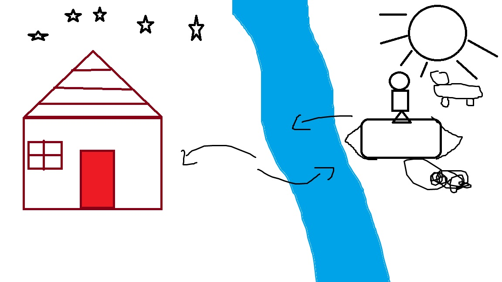
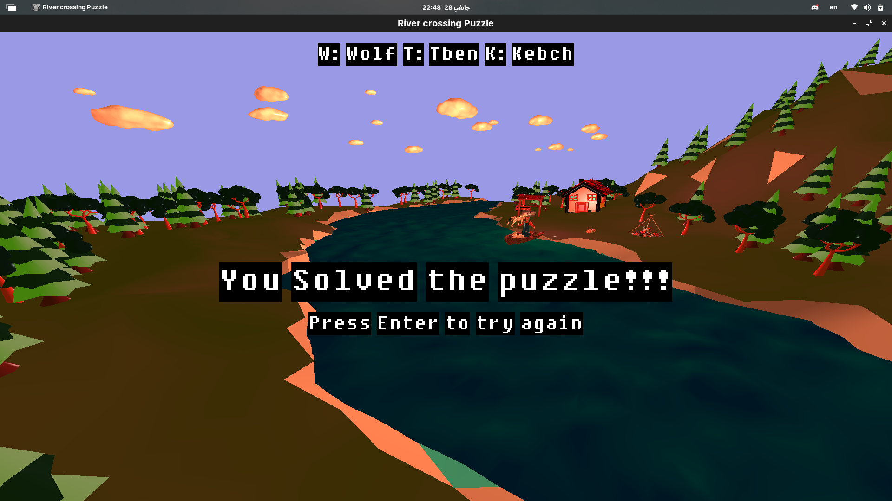
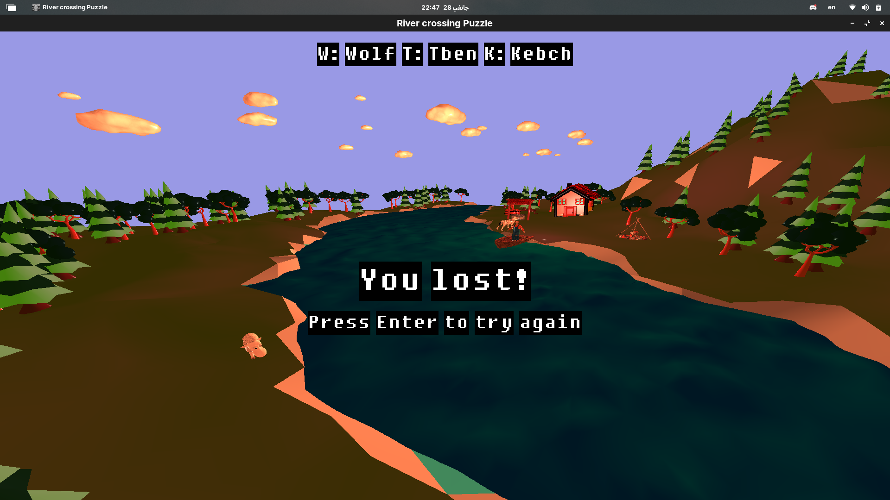

# River Crossing Puzzle Game

## Introduction

The River Crossing Puzzle Game is a classic puzzle that involves a farmer transporting a wolf, a sheep, and a cabbage across a river. The rules stipulate that the farmer cannot leave the wolf alone with the sheep, and the sheep cannot be left alone with the cabbage, as the wolf would eat the sheep, and the sheep would eat the cabbage.

This project implements the River Crossing Puzzle Game using OpenGL, GLFW, Glad, GLM, and other libraries for graphics rendering, along with additional features such as text rendering and user interface elements.



## Project Setup

### Dependencies
- OpenGL
- GLFW
- Glad
- GLM
- stb_image
- gltext
- Assimp

### Installation

1. Clone the repository:
   ```bash
   git clone https://github.com/raoufslv/River-Crossing-Puzzle-windows.git
   cd river-crossing-puzzle

## Build Instructions

Build the project using your preferred build system.

## Graphics Rendering

The graphics rendering is powered by OpenGL, with models loaded using Assimp and textures applied for a visually appealing experience.

## Text Rendering

Text rendering is implemented using the gltext library, providing clear communication with the player.

## Game Logic

The game logic adheres to the rules of the River Crossing Puzzle. Objects are represented, and their movements are controlled in compliance with the puzzle's constraints.

## How to Play

1. **Run the compiled executable.**

2. **Use the following keys:**
   - W: Move the wolf
   - T: Move the sheep
   - K: Move the cabbage
   - Enter: Start the game

3. **Successfully transport all elements to the other side without breaking the rules to win.**

## Screenshots


*Victory! All elements safely transported.*


*Game lost due to rule violation.*

## Conclusion

In conclusion, this project successfully implements the River Crossing Puzzle Game, showcasing the integration of various graphics technologies. It provides an interactive and visually appealing experience for players.

Feel free to contribute, report issues, or provide feedback.

## Credits

- [OpenGL](https://www.opengl.org/)
- [GLFW](https://www.glfw.org/)
- [Glad](https://github.com/Dav1dde/glad)
- [GLM](https://github.com/g-truc/glm)
- [stb_image](https://github.com/nothings/stb)
- [gltext](https://github.com/vallentin/glText)
- [Assimp](https://www.assimp.org/)
